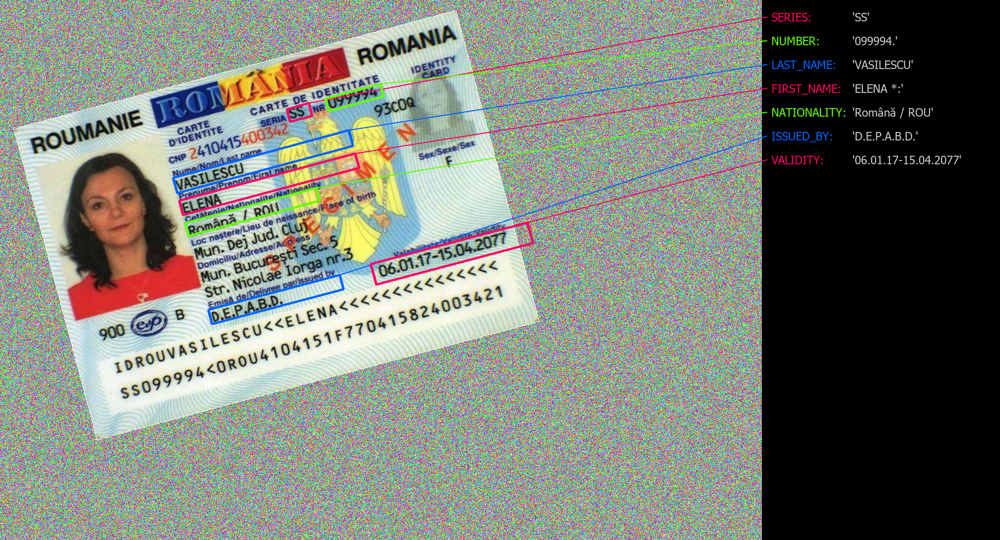

## About

This is a hands-on demo which exemplifies a robust method of extracting text from **Romanian ID Cards** (also known as *"buletine"*) using Cloud-based Services.
Unfortunately, the original images used to validate this cannot be published without heavy blurring to prevent disclosure of personal information.

However, two images are available for public access and have been also uplodaded in this repository. Both are ID card samples which present placeholder / invalid information and therefore do not belong to a specific person.


## Run

Ensure that you've installed the client API for overfitted.io:

```bash
pip3 install git+https://github.com/overfitted-io/python-api-client.git
```

and placed your API key in the `OVERFITTED_IO_API_KEY` environment variable:

```bash
export OVERFITTED_IO_API_KEY=123456789abcdef
```

Then you can simply run the script:

```bash
python3 script.py
```


## Expected Result

The expected result should correctly map the coordinates to the target image and extract the text as follows:



